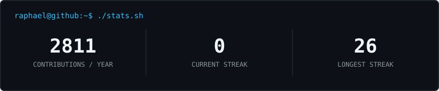

<div align="center">

<table>
<tr>
<td valign="top"></td>
<td valign="middle"></td>
</tr>
</table>

<p><strong>Applied Computer Science Student · AI Engineer · Full-Stack Developer</strong></p>

[](https://raphael.bleier.uk)
[](https://www.linkedin.com/in/raphael-bleier)
[](mailto:contact@bleier.uk)


</div>

---

### `raphael@github:~$ whoami`

```yaml
name:     Raphael Bleier
location: Austria
study:    Applied Computer Science
role:     AI Engineer & Full-Stack Developer
status:   Building useful things with AI
```

I build LLM-powered applications, agent workflows, and developer tools — from idea to production-ready product.

**Currently focused on**

- AI agent systems, LLM orchestration, and MCP servers
- Full-stack products with Next.js, TypeScript, and Python
- Developer tooling that makes AI-assisted work more reliable

---

### `raphael@github:~$ ls ./stack`

<div align="center">


</div>

---

### `raphael@github:~$ ./stats.sh`

<div align="center">



</div>

---

### `raphael@github:~$ ls ./projects`

<!--START_SECTION:projects-->
- [`rudarr_android`](https://github.com/raphaelbleier/rudarr_android) — A android Kotlin companion app for Radarr and Sonarr instances.
- [`userstory-playwright-skill`](https://github.com/raphaelbleier/userstory-playwright-skill) — Point your coding agent at a website codebase: it writes user stories into Excel, tests them with Playwright, and writes the bugs back. Works with Claude Code, Codex, Kilo Code, OpenCode and GitHub Copilot CLI.
- [`ccusage-panel`](https://github.com/raphaelbleier/ccusage-panel) — GNOME Shell top bar indicator for Claude Code and Codex usage powered by ccusage
- [`security-lab-aau-ss26-rubber-ducky`](https://github.com/raphaelbleier/security-lab-aau-ss26-rubber-ducky) — System Security Lab SS2026 – AAU Klagenfurt | W02a Rubber Ducky Payloads &amp; Documentation
- [`dataiku-ai-context`](https://github.com/raphaelbleier/dataiku-ai-context) — Dataiku DSS documentation bundles + Claude Code subagents for every major AI coding tool
- [`powerpoint_karaoke`](https://github.com/raphaelbleier/powerpoint_karaoke) — Present or Panic is a multiplayer PowerPoint Karaoke web app for local parties, workshops, and chaotic presentation nights.
<!--END_SECTION:projects-->

---

<div align="center">
<code>Open to collaborating on useful AI products and developer tools.</code>
</div>
