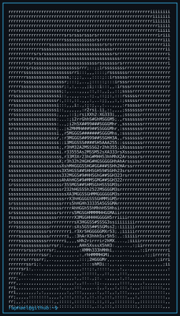
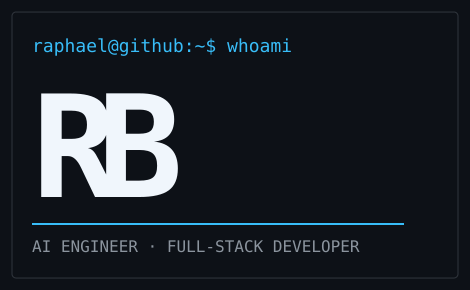
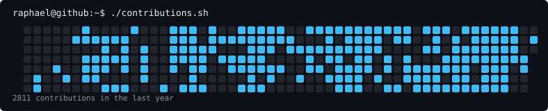

<div align="center">

<table>
<tr>
<td valign="top"></td>
<td valign="middle"></td>
</tr>
</table>

<p><strong>Applied Computer Science Student · AI Engineer · Full-Stack Developer</strong></p>

[](https://raphael.bleier.uk)
[](https://www.linkedin.com/in/raphael-bleier)
[](mailto:contact@bleier.uk)



</div>

---

### `raphael@github:~$ whoami`

```yaml
name:     Raphael Bleier
location: Austria
study:    Applied Computer Science
role:     AI Engineer & Full-Stack Developer
status:   Building useful things with AI
```

I build LLM-powered applications, agent workflows, and developer tools — from idea to production-ready product.

**Currently focused on**

- AI agent systems, LLM orchestration, and MCP servers
- Full-stack products with Next.js, TypeScript, and Python
- Developer tooling that makes AI-assisted work more reliable

---

### `raphael@github:~$ ls ./stack`

<div align="center">


</div>

---

### `raphael@github:~$ ./stats.sh`

<div align="center">


</div>

---

### `raphael@github:~$ ls ./projects`

<!--START_SECTION:projects-->
<table align="center">
<tr>
<td align="center" width="50%"><a href="https://github.com/raphaelbleier/rudarr_android"></a></td>
<td align="center" width="50%"><a href="https://github.com/raphaelbleier/userstory-playwright-skill"></a></td>
</tr>
<tr>
<td align="center" width="50%"><a href="https://github.com/raphaelbleier/ccusage-panel"></a></td>
<td align="center" width="50%"><a href="https://github.com/raphaelbleier/dataiku-ai-context"></a></td>
</tr>
<tr>
<td align="center" width="50%"><a href="https://github.com/raphaelbleier/powerpoint_karaoke"></a></td>
<td align="center" width="50%"><a href="https://github.com/raphaelbleier/security-lab-aau-ss26-rubber-ducky"></a></td>
</tr>
</table>
<!--END_SECTION:projects-->

---

<div align="center">
<code>Open to collaborating on useful AI products and developer tools.</code>
</div>
