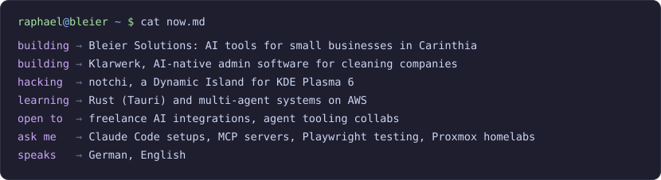
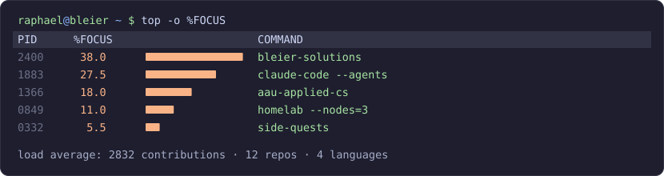
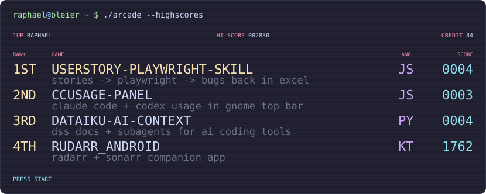
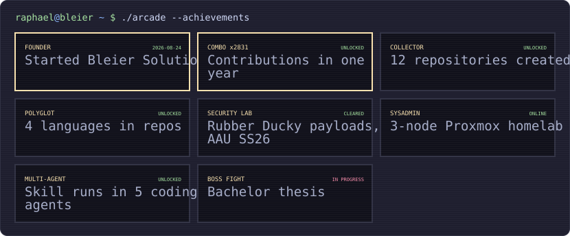
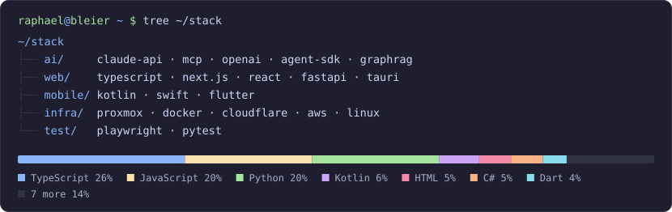
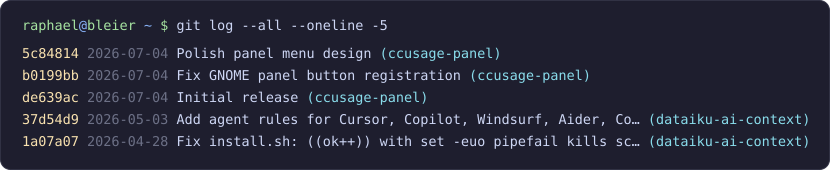
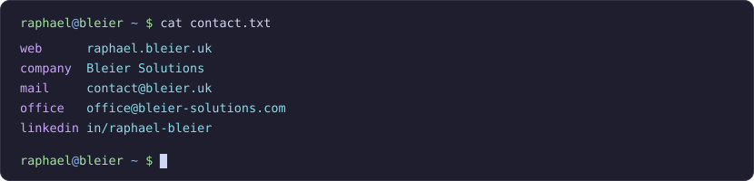

<!-- Generated by scripts/build.mjs from profile.json. Edit profile.json, not this file. -->

<a href="https://raphael.bleier.uk">raphael.bleier.uk</a> · <a href="https://bleier-solutions.com">Bleier Solutions</a> · <a href="mailto:contact@bleier.uk">contact@bleier.uk</a> · <a href="mailto:office@bleier-solutions.com">office@bleier-solutions.com</a> · <a href="https://www.linkedin.com/in/raphael-bleier">in/raphael-bleier</a>

